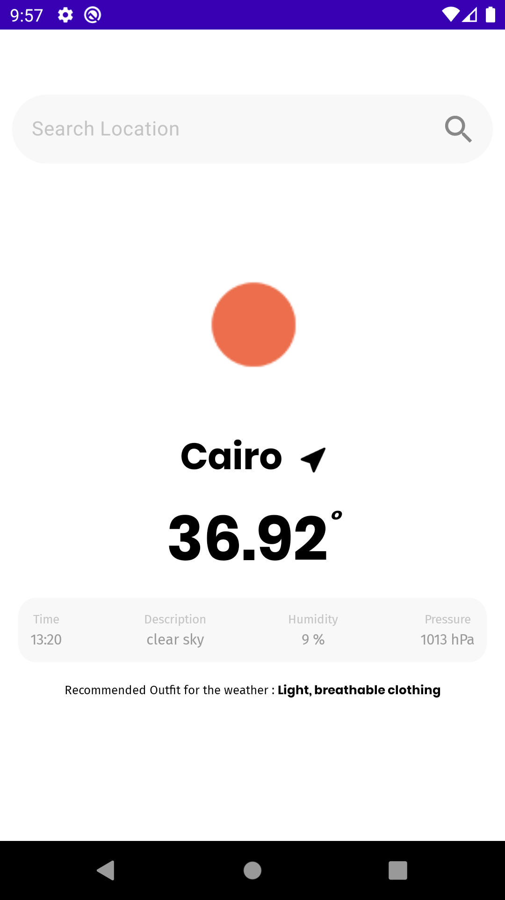
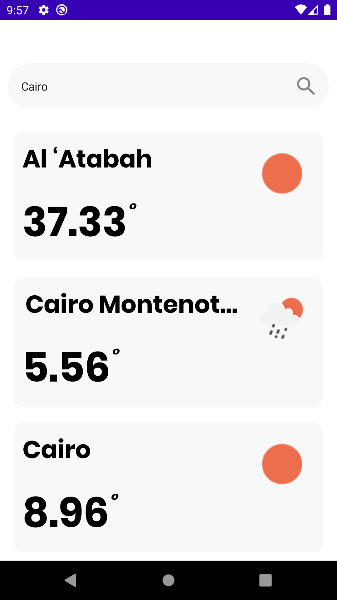
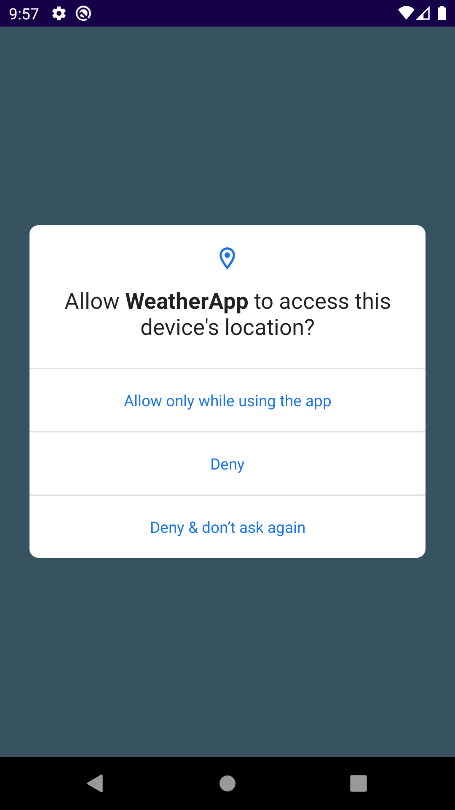
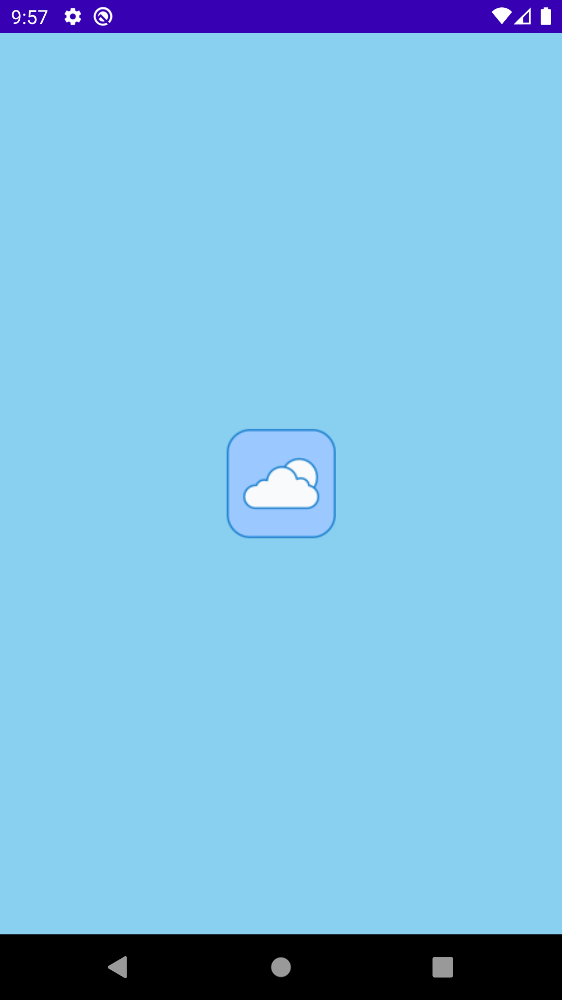

  

<h1 align="center">Weather App</h1>

Android App fetches weather information of specific locations and displays it on screen using MVVM architecture,Dagger hilt ,retrofit and Jetpack Compose.

## Tech Stacks

- <b>MVVM Architecture:</b> The Arch promotes reusability of code, greatly simplifying the process of creating simple user interfaces
- <b>Jetpack Compose:</b> Used Modern Tech of Jetpack Compose.
- <b>Hilt:</b> Used hilt for Dependency Injection
- <b>Retrofit:</b> Used fetch info from server.
- <b>OpenWeather Api:</b> Our Weather Api to get info about weather based on search.

## Screenshots

|                  Main Screen                      |                   Search Screen                    |               
|:-------------------------------------------------:|:--------------------------------------------------:|
|                     |                  |         
|                Permission Request                 |                       Splash Screen                | 
||           |      
                 
   

